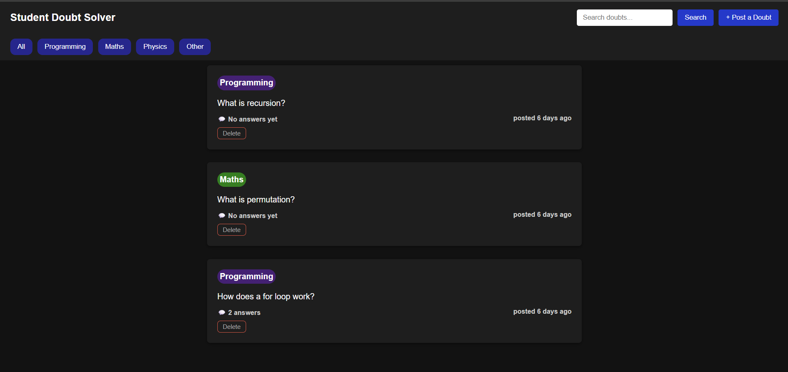
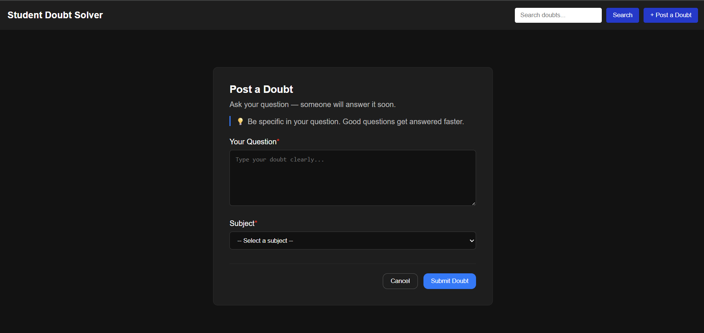
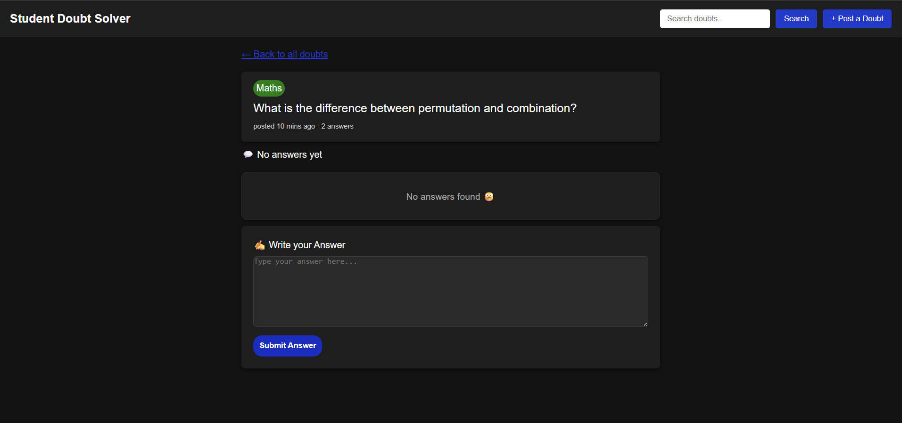

# 🎓 Student Doubt Solver

> A full stack web app where students post doubts anonymously and others answer them — a clean, organized alternative to chaotic WhatsApp groups.

---

## 📸 Screenshots

### Home Page — All Doubts


The home page shows all doubts posted by students. Each card displays the subject badge, question, answer count, and time posted. Students can filter doubts by subject (Maths, Programming, Physics) or search by keyword. Unanswered doubts appear first so nothing gets ignored.

---

### Post a Doubt


Students can post a new doubt by typing their question and selecting a subject from the dropdown. No login required — completely anonymous. After submitting, they are redirected back to the home page where their doubt appears instantly.

---

### Single Doubt + Answers


Clicking any doubt card opens the full doubt page. It shows the complete question, all answers posted by other students, and a text box to write a new answer. Answer count and time are updated in real time from the database.

---

## 💡 Why I Built This

Every engineering student faces this problem — you have a doubt, you post it in the WhatsApp group, it gets buried under 200 messages and nobody answers.

Student Doubt Solver fixes this with a clean platform where:
- Doubts are organized by subject
- Unanswered doubts appear first
- Anyone can answer anonymously
- Nothing gets lost

---

## ✨ Features

| Feature | Description |
|---|---|
| 📋 View Doubts | See all doubts with answer count and time posted |
| 🔍 Search | Search doubts by keyword instantly |
| 🏷️ Filter | Filter by subject — Maths, Programming, Physics |
| ✏️ Post Doubt | Submit a new doubt with subject tag |
| 💬 Answer | Answer any doubt anonymously |
| 🗑️ Delete | Remove your doubt and all its answers |
| ⏱️ Time Ago | Shows "2 mins ago", "3 hours ago" automatically |

---

## 🛠️ Tech Stack

| Layer | Technology | Purpose |
|---|---|---|
| Frontend | HTML, CSS, JavaScript | UI and user interaction |
| Backend | Node.js + Express | REST API server |
| Database | MySQL | Store doubts and answers |
| API calls | fetch() with async/await | Connect frontend to backend |

---

## 📁 Project Structure
```
student-doubt-solver/
├── frontend/
│   ├── index.html          ← home page
│   ├── post-doubt.html     ← post a doubt form
│   ├── doubt.html          ← single doubt + answers
│   ├── style.css           ← main styles
│   ├── doubt.css           ← doubt page styles
│   ├── script.js           ← home page logic
│   └── doubt-page.js       ← doubt page logic
├── backend/
│   ├── server.js           ← Express server
│   ├── db.js               ← MySQL connection
│   └── routes/
│       └── doubt.js        ← all API routes
├── screenshots/
│   ├── home.png
│   ├── post-doubt.png
│   └── doubt-page.png
└── README.md
```
---

## 🔌 API Endpoints

| Method | Endpoint | Description |
|---|---|---|
| GET | /api/doubts | Get all doubts with answer count |
| POST | /api/doubts | Post a new doubt |
| GET | /api/doubts/:id | Get single doubt by ID |
| DELETE | /api/doubts/:id | Delete a doubt and its answers |
| POST | /api/doubts/:id/answers | Submit an answer |
| GET | /api/doubts/:id/answers | Get all answers for a doubt |

---

## 🗄️ Database Schema

```sql
CREATE TABLE doubts (
  id INT AUTO_INCREMENT PRIMARY KEY,
  question TEXT NOT NULL,
  subject VARCHAR(50) NOT NULL,
  created_at TIMESTAMP DEFAULT CURRENT_TIMESTAMP
);

CREATE TABLE answers (
  id INT AUTO_INCREMENT PRIMARY KEY,
  doubt_id INT NOT NULL,
  answer_text TEXT NOT NULL,
  created_at TIMESTAMP DEFAULT CURRENT_TIMESTAMP,
  FOREIGN KEY (doubt_id) REFERENCES doubts(id)
);
```

---

## 🚀 How to Run Locally

1. Clone the repo
```bash
git clone https://github.com/devidasari666-beep/Student-doubt-solver
cd Student-doubt-solver
```

2. Install dependencies
```bash
cd backend
npm install
```

3. Create `.env` file inside `backend` folder
```
DB_HOST=localhost
DB_USER=root
DB_PASSWORD=yourpassword
DB_NAME=doubtdb
```
4. Create MySQL database
```sql
CREATE DATABASE doubtdb;
USE doubtdb;

CREATE TABLE doubts (
  id INT AUTO_INCREMENT PRIMARY KEY,
  question TEXT NOT NULL,
  subject VARCHAR(50) NOT NULL,
  created_at TIMESTAMP DEFAULT CURRENT_TIMESTAMP
);

CREATE TABLE answers (
  id INT AUTO_INCREMENT PRIMARY KEY,
  doubt_id INT NOT NULL,
  answer_text TEXT NOT NULL,
  created_at TIMESTAMP DEFAULT CURRENT_TIMESTAMP,
  FOREIGN KEY (doubt_id) REFERENCES doubts(id)
);
```

5. Start the server
```bash
node server.js
```

6. Open browser and visit `localhost:3000`

---

## 👤 Author

GitHub: github.com/devidasari666-beep